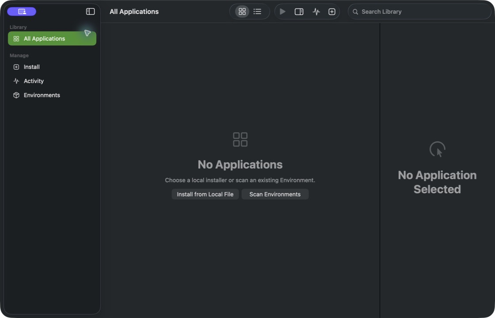
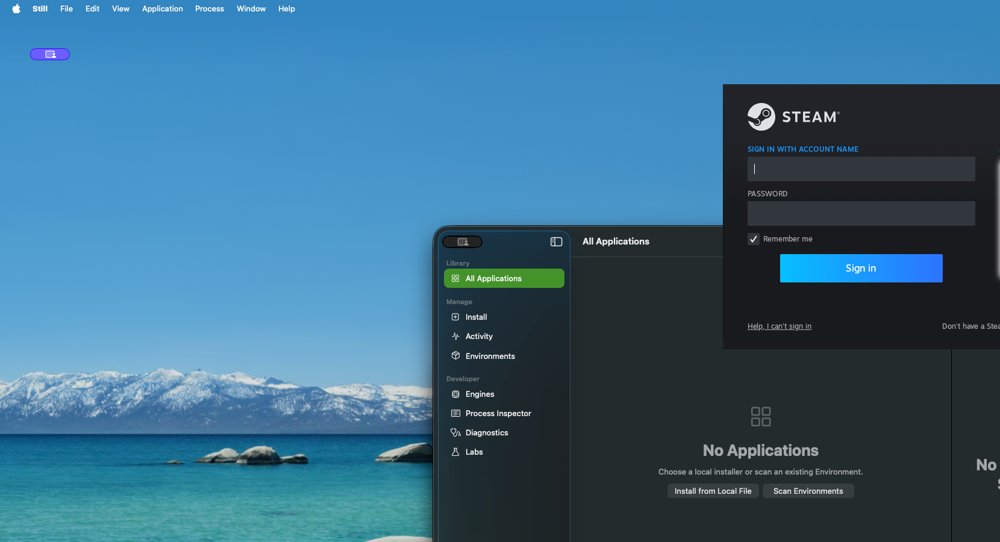

# Still

Still is a native macOS application for organizing and running Windows apps
and games with interchangeable Wine-compatible engines.

Applications, Environments, engines, graphics backends, and processes are
modeled separately. This keeps the Library independent from any single
launcher or compatibility engine.

## Status

The current release is **0.1.0-alpha.2**. Still remains pre-release software;
application compatibility varies by engine, macOS version, and graphics
backend. Release builds are ad hoc signed and are not notarized.

## Preview

### Native macOS library



Still keeps the ordinary Library, installation, activity, and Environment
workflow separate from advanced engine controls.

### Steam client UI on macOS



## Features

- Create, import, duplicate, back up, restore, and safely delete isolated Wine
  Environments.
- Install and switch versioned Wine-compatible engines.
- Apply compatibility Profiles and validated graphics or synchronization
  settings per application or Environment.
- Discover installed Windows applications while filtering helper executables.
- Use the Steam Preview Profile with a local installer selected by the user,
  then discover installed games as ordinary Library applications.
- Stop one or all sessions normally or forcefully with explicit scope.
- Rotate local launch logs and preview a redacted Support Bundle before export.
- Keep technical controls and raw diagnostics behind Developer Mode.

## Requirements

- Apple silicon Mac. Intel Macs are not supported.
- macOS 26 or later.
- A compatible Wine engine for the selected application.

## Compatibility

Compatibility depends on the application, engine, macOS version, graphics
backend, and runtime configuration. Validated results record the exact boundary
reached by each tested configuration.

See [Compatibility](Documentation/Compatibility.md) and
[Engines](Documentation/Engines.md) for supported configuration boundaries.
Validated application results are recorded in
[Compatibility results](Documentation/Compatibility-Results.md).

## Development

Xcode 16 or later and [XcodeGen](https://github.com/yonaskolb/XcodeGen) are
required to regenerate the project:

```sh
xcodegen generate
open Still.xcodeproj
```

Run the tests:

```sh
xcodebuild -project Still.xcodeproj -scheme Still test
```

Build the Debug application and update `/Applications/Still.app`:

```sh
Scripts/build-and-install-debug.sh
```

The script verifies that the built and installed executables have matching
SHA-256 digests.

Bug reports and pull requests are welcome. See
[Contributing](CONTRIBUTING.md) before submitting a change. Security issues
must be reported privately as described in [Security](SECURITY.md).

## Repository structure

```text
Sources/
  StillCore/       Models, persistence, compatibility, recovery, and processes
  StillDesktop/    Native macOS interface
  StillCLI/        Command-line operations
  StillChecks/     Runtime diagnostics
  StillBridge/     Native compatibility bridge source
Tests/
  StillCoreTests/
Documentation/
Patches/
Scripts/
```

## License

Still's original source code is available under the [MIT License](LICENSE).
Wine-derived patches and third-party components retain their respective
licenses. See [Third-party notices](THIRD_PARTY_NOTICES.md).
